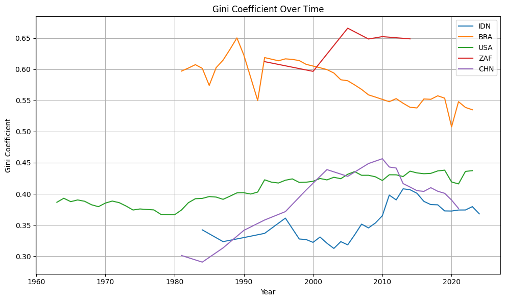
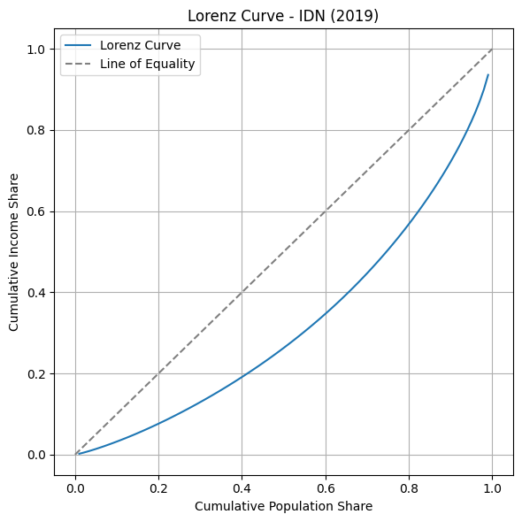
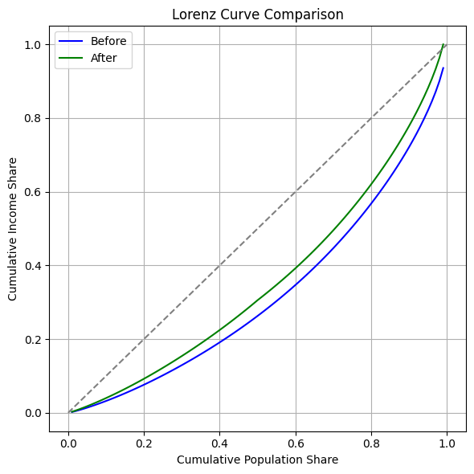

# 🌍 Global Income Inequality: Visualizing Lorenz Curves & Gini Coefficients

This project explores the patterns of income inequality around the world using data from the **World Bank's Poverty and Inequality Platform (PIP)**. Through the lens of **Gini Coefficients** and **Lorenz Curves**, we quantify inequality trends, simulate redistribution scenarios such as **targeted subsidies** and **progressive taxation**, and assess their impact on reducing inequality.

---

## 📦 Dataset
- **Source**: [World Bank - PIP Percentile Distributions](https://pip.worldbank.org)
- **Key variables**: `country_code`, `year`, `percentile`, `avg_welfare`, `pop_share`, `welfare_share`
- **Coverage**: 2,456 country-year distributions using microdata, grouped, or synthetic data

---

## 📊 Visualizations & Key Insights

### 1. **Gini Trends Across Selected Countries**
This line chart illustrates Gini coefficient trajectories over time for countries with diverse economic contexts:
- **Brazil (BRA)** and **South Africa (ZAF)** have persistently high inequality (>0.55)
- **United States (USA)** shows stable inequality in the range of 0.38–0.45
- **China (CHN)** experienced a sharp rise in inequality during economic liberalization, followed by a recent decline
- **Indonesia (IDN)** maintains moderate inequality but is still vulnerable

---

### 2. **Global Inequality Map**
A choropleth map of Gini coefficients using the most recent available year for each country. Darker red represents higher inequality.

---

### 3. **Lorenz Curve: Indonesia 2019**
This curve visualizes income distribution in Indonesia before any intervention.
- Gini: **0.3728**
- The bottom 20% of the population controls less than 5% of total income, while the top 10% controls a disproportionately large share.

---

### 4. **Redistribution Simulation: Subsidy vs Progressive Taxation**
#### 💰 Scenario 1: Direct Subsidy to Bottom 50%
- Adds $0.5 per capita to the poorest 50%
- Gini drops to **0.3020** (↓ 18.97%)

#### 💼 Scenario 2: Progressive Tax (10% tax on top 10%, redistributed to bottom 40%)
- Gini drops further to **0.2954** (↓ 20.74%)

---

### 5. **Lorenz Curve Comparison: Before vs After Redistribution**
The green line (after redistribution) shifts closer to the line of equality, reflecting a more equitable income distribution.

---

## 📈 Final Results Summary

| Scenario                        | Gini Coefficient | Change from Original |
|----------------------------------|------------------|------------------------|
| 🎯 Before Redistribution         | 0.3728           | —                      |
| 💰 Subsidy to Bottom 50%         | 0.3020           | ↓ 18.97%               |
| 💼 Tax Top 10% → Bottom 40%      | 0.2954           | ↓ 20.74%               |

---

## 🧭 Policy Implications
- Inequality remains a global issue, especially in Latin America and Sub-Saharan Africa.
- Direct subsidies help, but **progressive taxation** proves to be slightly more efficient in reducing inequality.
- **Lorenz curves and Gini coefficients** offer intuitive tools to evaluate redistribution policies.
- Countries with similar Gini values may differ greatly in who holds the wealth and how policies affect them.

---

## 📚 License
This project is built on publicly available data from the World Bank PIP and is intended for research and educational purposes only. Redistribution models are theoretical and do not represent real-world policy outcomes.
